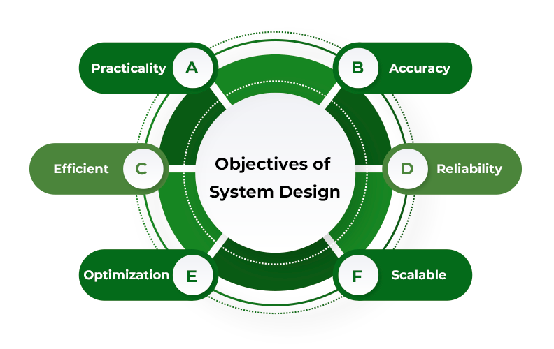

# System Design

System design is the process of defining the elements of a system such as the architecture, modules and components, the different interfaces of those components and the data that goes through that system. It is meant to satisfy specific needs and requirements of a business or organization through the engineering of a coherent and well-running system.

## Design Pattern

A well described solution to common software problems.

### Types of Design Pattern

- **Creational Patterns**: Creational patterns are primarily concerned with the process of object creation.
- **Structural Patterns**: Structural patterns deal with the composition of classes or objects. They use inheritance to compose interfaces and define ways to compose objects to obtain new functionalities.
- **Behavioral Patterns**: Behavioral patterns are concerned with the interaction and responsibility of objects. 

