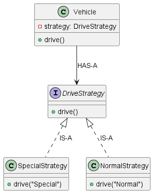

# Strategy Design Pattern

## Overview

The Strategy Design Pattern is a behavioral design pattern. Which is used when we have multiple algorithm for specific task and client decides the actual implementation to be used at runtime.

---

## Problem Without Strategy Pattern

Consider a class that performs different types of payment processing:

```java
if (paymentType.equals("CREDIT_CARD")) {
    // credit card logic
} else if (paymentType.equals("UPI")) {
    // upi logic
} else if (paymentType.equals("PAYPAL")) {
    // paypal logic
}
```

Problems:

- Violates Open/Closed Principle
- Hard to maintain
- Adding new payment type requires modifying existing code
- Large conditional blocks reduce readability


---

## Real-World Examples

- Payment processing systems
- Sorting algorithms (different sorting strategies)
- Compression algorithms (ZIP, RAR, etc.)
- Navigation apps (car, bike, walking routes)
- Tax calculation strategies
- Discount calculation systems

---

## Advantages

1. Follows Open/Closed Principle  
   New strategies can be added without modifying existing code.

2. Eliminates Conditional Logic  
   No large if-else or switch blocks.

3. Promotes Single Responsibility Principle  
   Each strategy has its own logic.

4. Easy to Extend  
   Just create a new class implementing the strategy interface.

5. Runtime Behavior Change  
   Behavior can be changed dynamically.

---

## Disadvantages

1. Increases Number of Classes  
   Each strategy requires a separate class.

2. Client Must Know About Strategies  
   The client decides which strategy to use.

3. Slightly More Complex Structure  
   Compared to simple conditional logic for very small systems.
---
Class Diagram


