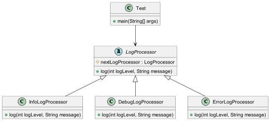

# Chain of Responsibility Design Pattern

The Chain of Responsibility pattern is a behavioral design pattern that allows an object to pass a request along a chain
of potential handlers until the request is handled. Each handler in the chain can either handle the request or pass it
on to the next handler in the chain. This pattern promotes loose coupling in software design by allowing the handlers to
be independent of each other.

## Logger Application

In this example, we have implemented a logging system using the Chain of Responsibility pattern. The logging system has
three levels of logs:

- **INFO**: General information.
- **DEBUG**: Debugging information.
- **ERROR**: Error messages.

Each log level is processed by a different log processor: `InfoLogProcessor`, `DebugLogProcessor`,
and `ErrorLogProcessor`. The log processors are chained together, so if one processor cannot handle a log message, it
passes it to the next processor in the chain.

### Code Overview

1. **LogProcessor (Abstract Class)**: The base class that defines the `log` method and the chain's structure.

2. **InfoLogProcessor**: Handles `INFO` level logs. If it cannot handle the log, it passes it to the next processor.

3. **DebugLogProcessor**: Handles `DEBUG` level logs. If it cannot handle the log, it passes it to the next processor.

4. **ErrorLogProcessor**: Handles `ERROR` level logs.

5. **Test**: Sets up the chain and processes some log messages.

# Class Diagram

