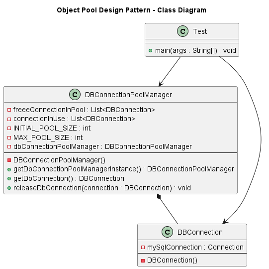

# Object Pool Design Pattern

The Object Pool pattern is a creational design pattern that manages a pool of reusable objects instead of creating and destroying objects repeatedly.

It is especially useful when:

- Object creation is expensive
- Objects are resource-intensive
- You want to improve performance
- You need controlled resource management

---

## Advantages

1. Improved Performance  
   Reduces expensive object creation.

2. Better Resource Management  
   Limits maximum resource usage.

3. Faster Response Time  
   Reuses existing objects.

4. Controlled Scalability  
   Prevents uncontrolled resource consumption.

5. Suitable for High Traffic Systems

---

## Disadvantages

1. Increased Complexity  
   Requires proper management logic.

2. Risk of Resource Leak  
   If objects are not returned to pool.

3. Idle Object Memory Usage  
   Objects remain in memory even if unused.

4. Requires Thread Safety  
   Must handle concurrency carefully.

---

## Class Diagram
