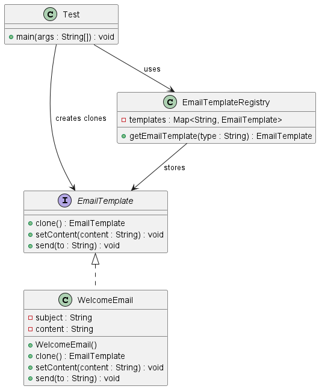

## Definition

The **Prototype Design Pattern** is a creational design pattern that allows you to create new objects by cloning an existing object (prototype) instead of creating them from scratch using constructors.

It relies on copying an existing instance and modifying it as needed.

---

## What Problem Does It Solve?

In many applications:

- Object creation is expensive (heavy configuration, DB calls, complex setup)
- Multiple similar objects are required with small changes
- Object creation logic becomes repetitive

Without Prototype:
- You create new objects repeatedly
- Initialization logic is duplicated
- Performance may degrade

With Prototype:
- You clone a pre-configured object
- Avoid repeated initialization
- Improve performance and maintainability

---

##  Real-Time Example (Fintech Context)

In banking applications:
- Welcome emails
- Loan approval notifications
- EMI reminders
- KYC verification emails

Instead of creating every email template from scratch, we:
1. Store a base template
2. Clone it
3. Customize content
4. Send it

This keeps template management centralized and scalable.

---

## Components in This Project

- **EmailTemplate** → Prototype Interface
- **WelcomeEmail** → Concrete Prototype
- **EmailTemplateRegistry** → Prototype Registry
- **Test** → Client

The registry stores base templates and returns cloned copies to the client.

---

## When to Use Prototype Pattern?

Use Prototype when:

✔ Object creation is expensive  
✔ You need many similar objects  
✔ Object initialization is complex  
✔ You want to avoid subclass explosion  
✔ You want to centralize configuration
---

## Advantages 
✔ **Improves Performance**  
Cloning is faster than creating and initializing from scratch.

✔ **Reduces Duplicate Code**  
Initialization logic exists in one place.

✔ **Easy to Add New Types**  
Just register a new prototype in the registry.

✔ **Simplifies Object Creation**  
Client doesn’t need to know how object is created.

---

##  Disadvantages

❌ **Deep Cloning Can Be Complex**  
If object contains nested mutable objects, careful cloning is required.

❌ **Clone Method Must Be Implemented Carefully**  
Incorrect cloning may lead to shared references.

❌ **Debugging Can Be Harder**  
Tracking object origin (cloned vs new) may be confusing.

---

## 🔄 Prototype vs Traditional Object Creation

| Traditional | Prototype |
|-------------|------------|
| Uses `new` keyword | Uses `clone()` |
| Repeats initialization | Reuses existing configuration |
| Slower if setup is heavy | Faster cloning |

---

## Class Diagram
