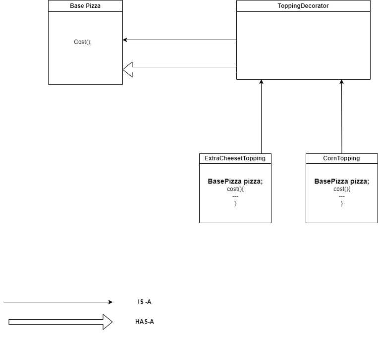

# E-commerce Customizable Pizza Ordering System

This project demonstrates the use of the Decorator Design Pattern in an e-commerce application to create a customizable pizza ordering system. The pattern allows dynamic addition of various pizza toppings without altering the core pizza object.

## Overview

The Decorator Design Pattern is a structural pattern that enables behavior to be added to individual objects dynamically. At the same time other instances of the same class will not be affected by this , so individual objects gets the modified behavior.

### Why Use the Decorator Pattern?

- **Extend Functionality**: Dynamically add responsibilities to objects without modifying their code.
- **Promote Flexibility**: Combine different decorators at runtime to achieve desired behavior.
- **Enhance Maintainability**: Avoid a complex inheritance hierarchy by using composition.

