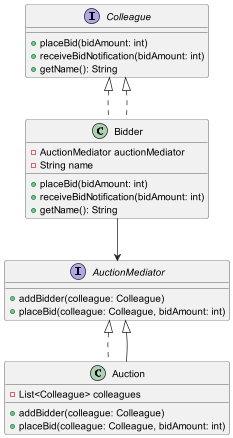

# Mediator Design Pattern

The Mediator Design Pattern encourage loose coupling by keeping objects from referring to each other explicitly and allows them to `coummunicate through a mediator object`. 

## Auction System

In this example, we implement an auction system where multiple bidders can place bids on an item. The `AuctionMediator` acts as the mediator, coordinating the interaction between different `Bidder` objects.

### Components:

1. **AuctionMediator Interface:** This interface defines the contract for adding bidders and placing bids.
2. **Auction Class:** Implements the `AuctionMediator` interface. It maintains a list of all bidders and notifies them when a new bid is placed, except the bidder who placed the bid.
3. **Colleague Interface:** This interface defines the contract for bidders, including placing bids and receiving bid notifications.
4. **Bidder Class:** Implements the `Colleague` interface. It uses the mediator to place a bid and receive notifications when other bidders place bids.

### How it Works:

- Multiple `Bidder` objects register with the `Auction` mediator.
- When a bidder places a bid, the mediator notifies all other bidders about the new bid amount.
- This ensures that bidders do not directly interact with each other but only through the mediator.

## Class Diagram

