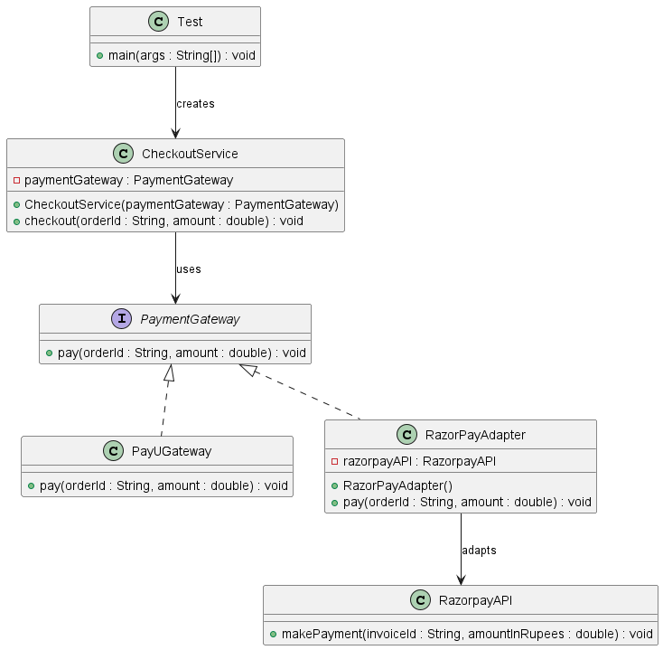

## Definition

The **Adapter Design Pattern** is a structural design pattern that allows incompatible interfaces to work together.
It acts as a bridge between two incompatible interfaces by converting one interface into another expected by the client.

---

##  What Problem Does It Solve?

In real-world systems:

- Third-party APIs have different method names
- Legacy systems use incompatible interfaces
- You cannot modify external libraries
- Switching providers causes major code changes

Without Adapter:
- Client code becomes tightly coupled to third-party APIs
- Changing payment provider requires modifying business logic
- Violates Open-Closed Principle

With Adapter:
- Client talks to a common interface
- Third-party API differences are hidden
- Easy to switch payment providers
- Business logic remains untouched

---

## Real-Time Example (Fintech / E-commerce)

In payment systems:

- Razorpay has `makePayment()`
- PayU has `pay()`
- Stripe may have `processTransaction()`

But your system expects:

```java
void pay(String orderId, double amount);
```

The Adapter converts third-party API methods into your standard interface.

---

##  Components in This Project

### 1️⃣ PaymentGateway (Target Interface)

Defines the standard method:
```java
void pay(String orderId, double amount);
```

---

### 2️⃣ PayUGateway (Concrete Implementation)

Direct implementation of PaymentGateway.  
No adaptation required.

---

### 3️⃣ RazorpayAPI (Adaptee)

Third-party API with incompatible method:
```java
void makePayment(String invoiceId, double amountInRupees);
```

---

### 4️⃣ RazorPayAdapter (Adapter)

- Implements PaymentGateway
- Wraps RazorpayAPI
- Converts `pay()` call into `makePayment()`

This is the core of Adapter Pattern.

---

### 5️⃣ CheckoutService (Client)

Depends only on PaymentGateway interface.

It does not know:
- Which payment provider is used
- How third-party APIs work

---

## 🔄 Flow of Execution

1. Client calls `checkout()`
2. CheckoutService calls `pay()`
3. If RazorPayAdapter is used:
    - Adapter converts call to `makePayment()`
4. Payment is processed

---

##  When to Use Adapter Pattern?

Use Adapter when:

✔ You want to integrate third-party libraries  
✔ Interfaces are incompatible  
✔ You cannot modify existing class  
✔ You want to follow Open-Closed Principle

Avoid when:

✖ Interfaces are already compatible  
✖ Adding unnecessary abstraction

---

## Advantages

✔ **Loose Coupling**  
Client depends only on interface, not concrete class.

✔ **Open-Closed Principle**  
New payment gateways can be added without modifying CheckoutService.

✔ **Reusability**  
Existing third-party classes can be reused.

✔ **Single Responsibility**  
Conversion logic stays inside adapter.

---

## Disadvantages

✖ **Extra Layer of Abstraction**  
Adds additional class which increases complexity slightly.

✖ **Too Many Adapters Can Increase Codebase Size**  
If many third-party systems exist.

✖ **May Hide API Differences**  
Some advanced features of third-party API may not be exposed.

---

## Class Diagram
