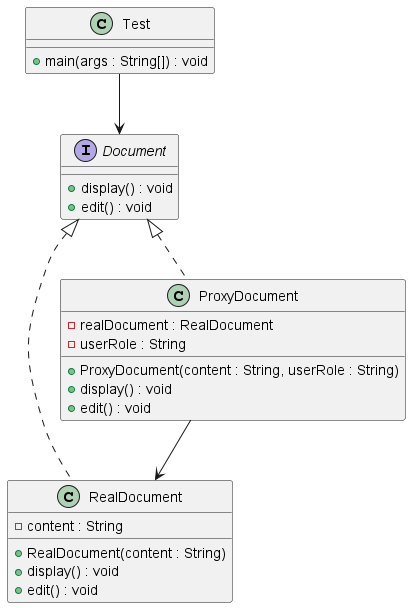

##  Definition

The **Proxy Design Pattern** is a structural design pattern that provides a placeholder (proxy) for another object to control access to it.
The proxy acts as a surrogate or representative of the real object.

---

##  What Problem Does It Solve?

In real-world systems:

- You need access control (authorization)
- Object creation is expensive (lazy loading)
- Logging or monitoring is required
- Remote communication is involved

Without Proxy:
- Client directly accesses the real object
- No control over who can perform operations
- Violates Single Responsibility (business + access logic mixed)

With Proxy:
- Access control logic is separated
- Real object remains clean
- Security and monitoring become centralized

---

## Real-Time Example (Banking / Enterprise System)

Consider a banking document system:

- Only ADMIN users can edit documents
- Normal users can only view documents

The Proxy checks:
If userRole == ADMIN → allow edit  
Else → deny access

The RealDocument focuses only on document logic.

---

##  Components in This Project

### 1️⃣ Document (Subject Interface)

Defines common operations:
```java
void display();
void edit();
```

---

### 2️⃣ RealDocument (Real Subject)

- Implements Document
- Contains actual business logic
- Handles display and edit operations

---

### 3️⃣ ProxyDocument (Proxy)

- Implements Document
- Holds reference to RealDocument
- Adds access control logic before delegating

Core logic:
```java
if ("ADMIN".equals(userRole)) {
    realDocument.edit();
} else {
    System.out.println("Access denied");
}
```

---

### 4️⃣ Test (Client)

Client interacts only with Document interface.

It does not know:
- Whether it is calling RealDocument
- Or ProxyDocument

---

## 🔄 Flow of Execution

1. Client creates ProxyDocument
2. Client calls display()
3. Proxy forwards call to RealDocument
4. Client calls edit()
5. Proxy checks role:
    - ADMIN → forward to RealDocument
    - USER → deny access

---


## Advantages 

✔ **Access Control**  
Security logic can be implemented without modifying real object.

✔ **Single Responsibility**  
Real object handles business logic only.

✔ **Open-Closed Principle**  
New proxy behaviors can be added without modifying real class.

✔ **Lazy Loading Support**  
Real object can be created only when needed.

---

## Disadvantages

✖ **Increased Complexity**  
Adds extra class to system.

✖ **Performance Overhead**  
Extra method call layer.

✖ **Can Increase Codebase Size**  
If many proxies are created.

---

## 🆚 Proxy vs Direct Access

| Direct Access | Proxy |
|--------------|--------|
| No access control | Access control possible |
| Business + security mixed | Clean separation |
| Less flexible | Highly flexible |

---

## 🎯 Class Diagram

