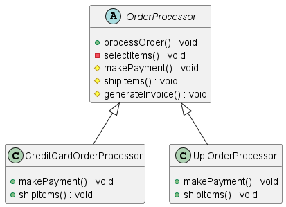

# Template Method Design Pattern

The **Template Method Design Pattern** defines the skeleton of an algorithm in a method, deferring some steps to
subclasses. It lets subclasses redefine certain steps of an algorithm without changing the algorithm's structure.

## Order Processing System

Consider an `OrderProcessor` system where different types of orders (e.g., Credit Card or PayPal payments) need to be
processed. The general process involves selecting items, making payment, generating an invoice, and shipping the items.
The process remains the same for all orders, but specific steps, like payment method and shipping, vary.

### Implementation

We have an abstract class `OrderProcessor` that defines the template method `processOrder()`. This method outlines the
steps involved in processing an order but allows subclasses to customize specific steps.

**Abstract Class: `OrderProcessor`**

- Methods:
    - `processOrder()`: Template method that calls several steps in a specific order.
    - `selectItems()`: Common method for all subclasses (implemented in the base class).
    - `makePayment()`: Abstract method to be implemented by subclasses.
    - `shipItems()`: Abstract method to be implemented by subclasses.
    - `generateInvoice()`: Hook method with a default implementation.

**Concrete Classes:**

- `CreditCardOrderProcessor`: Implements `makePayment()` and `shipItems()` specific to Credit Card payments.
- `UpiOrderProcessor`: Implements `makePayment()` and `shipItems()` specific to UPI payments.

# UML Diagram

